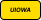

# ECE:3360 - Embedded Systems (Spring 2025)
**Instructor:** Professor Reinhard Beichel, University of Iowa

### Description:
This repository contains the lab work and final project for the Embedded Systems course at the University of Iowa. The course consists of five progressive labs and culminates in a final project, each focusing on different aspects of embedded systems development.

---

### Project Tags

  
  
  
  

---

## Labratories

#### Lab 1: Blinky 
- [README](labs/lab1/README.md)
- no report

#### Lab 2: Counter with 7-Segment Display
- [README](labs/lab2/README.md)
- [Lab Report](labs/lab2/lab_report/es_lab_report_2.pdf)

#### Lab 3: Simple Electronic Lock
- [README](labs/lab3/README.md)
- [Lab Report](labs/lab3/lab_report/es_lab_report_3.pdf)

#### Lab 4: LCD display with PWM Fan
- [README](labs/lab4/README.md)
- [Lab Report](labs/lab4/lab_report.pdf)

#### Lab 5: Serial Communication
- [README](labs/lab5/README.md)
- [Lab Report](labs/lab5/lab_report.pdf)

## Authors  

  

    
    

      Sage Marks
    

    

      <a href="mailto:sage-marks@uiowa.edu">Email</a> | <a href="https://www.linkedin.com/in/sage-marks-71a044293/">LinkedIn</a>
    

  

  

    
    

      Matt Krueger
    

    

      <a href="mailto:matthew-krueger@uiowa.edu">Email</a> | <a href="https://www.linkedin.com/in/mattnkrueger/">LinkedIn</a>
    

  

              
    
